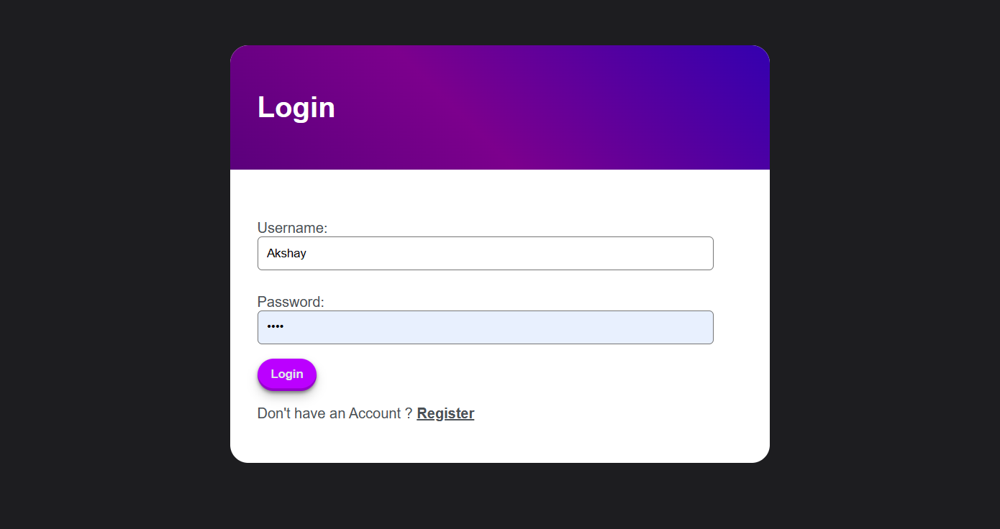

# To Do List Application

This is a comprehensive Todo list application built with Django, allowing users to manage their tasks efficiently.

## Table of Contents
- [Features](#features)
- [Technologies used](#technologies-used)
- [Installation](#installation)
- [Usage](#usage)

## Features
- ### User authentication: Users can sign up, log in, and log out.

- ### Create, update, and delete tasks.

- ### Mark tasks as completed or pending.
- ### Filter tasks by completion status or due date.
- ### Responsive design for easy use on desktop and mobile devices.

## Technologies Used

- **Django:** Web framework for building the backend.
- **HTML/CSS:** Frontend design and styling.
- **SQLite:** Database for storing tasks and user information.

## Installation

1. Clone the repository: `git clone https://github.com/Akshayparihar07/ToDo_app_Django.git`
2. 
2. Navigate to the project directory: `cd ToDo_app_Django`
3. 
3. Install dependencies: `pip install -r requirements.txt`
4. Apply migrations: `python manage.py migrate`
5. Run the development server: `python manage.py runserver`
6. Access the application in your web browser at http://localhost:8000/

## Usage

1. Register a new account or log in with existing credentials.
2. Add new tasks using the `"+"` button.
3. Update tasks by clicking on them and editing the details.
4. Mark tasks as completed by checking the checkbox in the update section.
5. Delete tasks by clicking on the `"X"` icon.

## Contributing

Contributions are welcome! If you'd like to contribute to this project, please follow these steps:

1. Fork the repository.
2. Create a new branch (`git checkout -b feature-branch`).
3. Make your changes.
4. Commit your changes (`git commit -am 'Add new feature'`).
5. Push to the branch (`git push origin feature-branch`).
6. Create a new pull request.

## Author: [Akshay Parihar] (https://github.com/Akshayparihar07)

